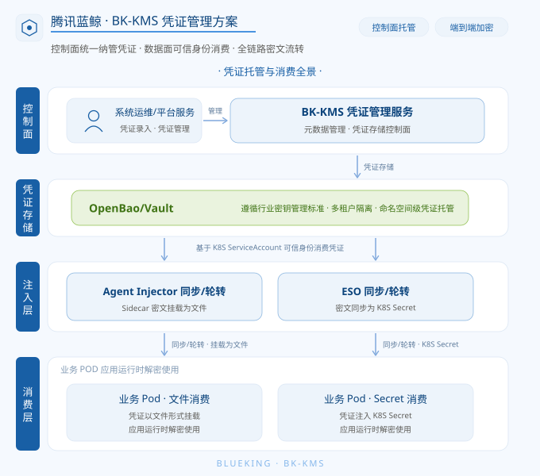
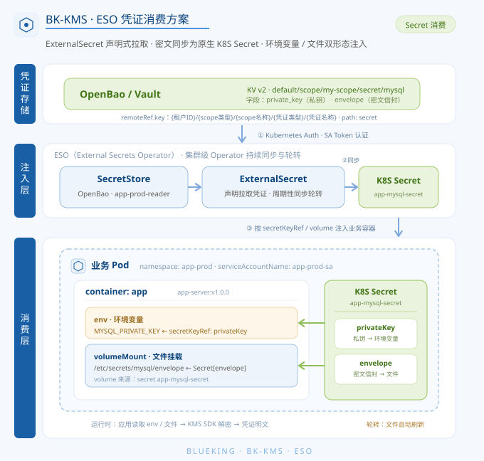
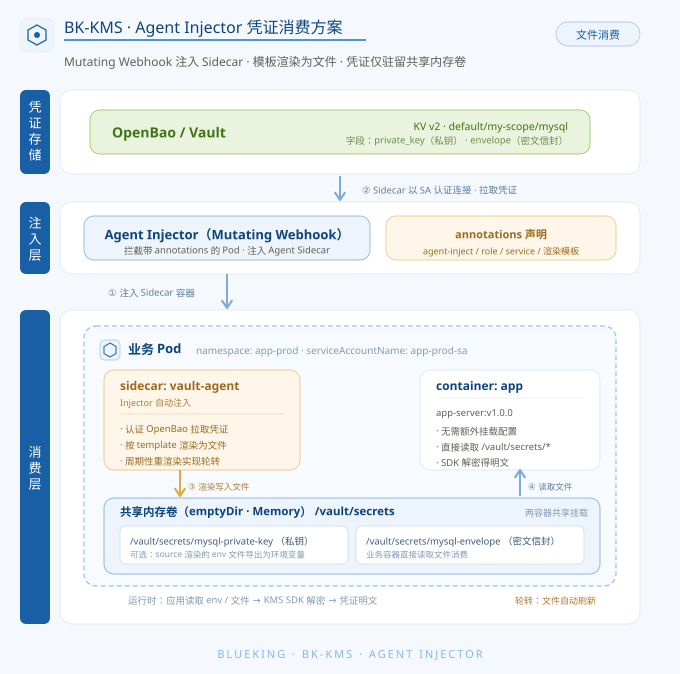

# BK-KMS 凭证管理集成方案

蓝鲸智云凭证管理服务（BlueKing Key Management Service，简称 BK-KMS）提供一套控制面统一纳管凭证、数据面可信身份消费、全链路密文流转的凭证托管与集成方案, 本文档从集成角度对方案做详细介绍。

## 方案总览

集成方案按职责自上而下分为四层：控制面、凭证存储、注入层、业务消费层。凭证在录入后以密文形式流转，仅在业务应用运行时解密使用，业务侧无需持久化敏感数据。



### 控制面

- **系统运维/平台服务**：负责凭证录入与凭证管理;
- **凭证管理服务**：凭证存储的控制面，负责元数据管理，并将凭证写入底层存储;

### 凭证存储

- **OpenBao/Vault**：作为底层密钥存储，遵循行业密钥管理标准，支持多租户隔离与命名空间级凭证托管;

### 注入层

基于 K8S ServiceAccount 的可信身份从存储中消费凭证，并同步/轮转到业务侧，支持两种集成方式：

- **ESO（External Secrets Operator）**：将密文同步为 K8S Secret;
- **Agent Injector**：以 Sidecar 方式将密文挂载为文件;

### 消费层

业务 Pod 在应用运行时解密并使用凭证，对应两种消费形态：

- **Secret 消费(推荐)**：凭证注入 K8S Secret，应用运行时解密使用;
- **文件消费**：凭证以文件形式挂载，应用运行时解密使用;

## 前置：KMS 凭证录入

业务侧接入前，平台运维需先在 KMS 控制面录入一条凭证。

凭证的底层存储与消费所需的存储引擎、认证方法、授权策略（Policy/Role 绑定）等均由 KMS 在录入时自动完成，业务与运维无需感知，也无需手动配置底层 OpenBao, 录入方只需提供凭证的基础信息与消费鉴权信息即可。

### 通过 KMS 接口录入凭证

凭证通过 KMS「创建凭证create_credential」接口录入，核心信息分为三部分：

- **scope（业务范围）**：凭证归属的租户/业务范围，决定凭证的隔离与路径前缀。
- **metadata（凭证基础信息）**：凭证名称与原文内容等，`value` 需先做混合（信封）加密后再提交。
- **auth（消费鉴权信息）**：声明允许消费该凭证的 K8S 可信身份，即后文 ESO / Injector 认证时使用的 ServiceAccount 与角色, `auth` 为一个**列表**，支持为同一凭证配置**多组** role 绑定，每组由一个 `role` 及绑定它的 ServiceAccount 名称/命名空间列表组成。

其中与业务侧消费直接相关的是 `auth`，列表中每一组的字段如下：

| 字段                             | 说明                                                                                             | 与消费侧的对应关系                                                           |
|----------------------------------|--------------------------------------------------------------------------------------------------|------------------------------------------------------------------------------|
| `role`                           | 绑定这些 ServiceAccount 用于消费凭证的角色名；不传递则使用 `default` 作为角色名                  | 对应 ESO `SecretStore` 的 `role` 与 Injector 注解 `vault.hashicorp.com/role` |
| `service_account_name_list`      | 允许消费该凭证的 ServiceAccount 名称列表；不传递则不限制 ServiceAccount 名称（任意名称均可消费） | 对应业务 Pod 使用的 ServiceAccount 名称（下文示例中的 `app-prod-sa`）        |
| `service_account_namespace_list` | 上述 ServiceAccount 所在命名空间列表；不传递则不限制命名空间（任意命名空间均可消费）             | 对应业务 Pod 所在命名空间（下文示例中的 `app-prod`）                         |

**录入示例（KMS 创建凭证接口create_credential）:**

```json
{
    "scope": {
        "scope_type": "scope",
        "scope_id": 1
    },
    "metadata": {
        "name": "mysql",
        "value": "BASE64_HYBRID_ENCRYPTED_CONTENT",
        "description": "业务 MySQL 凭证",
        "annotation": ""
    },
    "auth": [
        {
            "role": "app-prod-reader",
            "service_account_name_list": ["app-prod-sa"],
            "service_account_namespace_list": ["app-prod"]
        }
    ]
}
```

> - `value` 需先做混合（信封）加密后再填入，加密方式详见 KMS `get_crypto_info` 接口文档。
> - `auth` 为列表，可配置多组 role 绑定：如需让不同角色/不同命名空间的 ServiceAccount 消费同一凭证，在列表中追加多组配置即可。
> - `auth` 中声明的 SA/命名空间/角色，务必与后文 ESO / Injector 示例中业务 Pod 实际使用的 `serviceAccountName`、`namespace` 及 `role` 保持一致，否则消费时认证不通过。

凭证录入成功后，凭证在消费侧的引用路径形如 `{租户ID，非多租户为 default}/{scope，业务名称}/{凭证名称}`（下文示例为 `default/my-scope/mysql`），KMS 会依据 scope 与凭证名录入凭证以供业务进行消费。

### 通过 kmsctl 命令行管理工具录入凭证

除直接调用「创建凭证create_credential）」接口外，KMS 提供命令行工具 `kmsctl` 用于录入与维护凭证。

该工具随 KMS 镜像分发（默认位于 `/data/kms/tools/kmsctl`），支持以一份 YAML 声明式地管理业务（scope）及其下的凭证：scope 不存在则创建、存在则更新；凭证按 `name` 匹配，不存在则创建、存在则更新。凭证的 `value` 传入原文明文，工具会在 apply 时自动完成混合（信封）加密。

**1. 编写凭证声明文件（如 `my_scope_credential.yaml`）:**

```yaml
scope:
  # 资源范围类型，当前可选值：scope
  type: scope
  # 资源范围名称（对应消费路径中的业务名）
  name: my-scope
  description: example scope
  # 该 scope 下的凭证列表
  credentials:
    # 凭证名称，同一 scope 下唯一，作为匹配创建/更新的依据
    - name: mysql
      # 凭证原文（明文），apply 时自动做混合(信封)加密
      value: 'change-me'
      description: 业务 MySQL 凭证
      annotation: ""
      # 凭证的鉴权配置列表，支持多组配置，每组由一个 role 与绑定它的 ServiceAccount 名称/命名空间组成
      auth:
          # 绑定这些 ServiceAccount 用于消费凭证的角色名
        - role: app-prod-reader
          # 允许消费该凭证的 ServiceAccount 名称列表
          service_account_name_list:
            - app-prod-sa
          # 上述 ServiceAccount 所在命名空间列表
          service_account_namespace_list:
            - app-prod
```

**2. 应用声明，完成录入:**

```bash
kmsctl apply -f my_scope_credential.yaml
```

其中凭证 `auth` 列表的每一组 `role`、`service_account_name_list`、`service_account_namespace_list` 声明一组消费鉴权信息，对应「创建凭证」接口 `auth` 字段，务必与后文 ESO / Injector 示例中业务 Pod 实际使用的 `serviceAccountName`、`namespace` 及 `role` 保持一致，否则消费时认证不通过。

> - `auth` 为列表，支持配置多组 role 绑定：如需让不同角色/不同命名空间的 ServiceAccount 消费同一凭证，在列表中追加多组配置即可。
> - 每组内三项消费鉴权字段均为可选：不填写 `service_account_name_list` / `service_account_namespace_list` 则不限制消费凭证的 ServiceAccount 名称 / 命名空间（任意 SA 均可消费）；不填写 `role` 则使用 `default` 作为角色名。

更多子命令及参数（`create`/`list`/`get`/`update`/`delete` 等）可执行 `kmsctl --help` 查看。

## 业务 ESO（External Secrets Operator）凭证消费

ESO 是 K8S 上主流的外部密钥同步组件，通过 Operator 持续将外部密钥系统中的凭证同步为原生 K8S Secret。集成时以业务 Pod 的 ServiceAccount 为可信身份，经 Kubernetes Auth 认证连接 OpenBao，由 ExternalSecret 声明式地拉取指定凭证并生成 Secret，再按需以环境变量或文件形式注入业务容器。凭证同步与轮转由 ESO 依据刷新周期自动完成，业务侧仅消费标准 K8S Secret，无侵入、可复用平台既有的 Secret 消费能力。



**0. 业务 ServiceAccount —— 访问 OpenBao 的可信身份: **

```yaml
apiVersion: v1
kind: ServiceAccount
metadata:
  name: app-prod-sa
  namespace: app-prod
```

**1. SecretStore —— 用 SA Token 认证连接 OpenBao: **

```yaml
apiVersion: external-secrets.io/v1
kind: SecretStore
metadata:
  name: openbao-store
  namespace: app-prod
spec:
  provider:
    vault:
      # 蓝鲸 KMS 托管的 OpenBAO 服务地址
      server: "https://openbao.bk-kms.svc:8200"
      path: "secret"
      version: "v2"
      # 以下 TLS / mTLS 配置仅在 OpenBao 正式环境开启了证书时才需要，默认（未开启 TLS）可整段删除。
      # TLS：验证 OpenBao 服务端证书（OpenBao 开启 TLS 时使用，OpenBao Secret 需集群运维部署预先准备）
      # caProvider:
      #   type: "Secret"
      #   name: "openbao-tls"
      #   key: "ca.crt"
      #   namespace: "app-prod"
      # mTLS：ESO 提供客户端证书（OpenBao 要求客户端双向认证时使用, OpenBao Secret 需集群运维部署预先准备）
      # clientTls:
      #   certSecretRef:
      #     name: "openbao-client-tls"
      #     key: "tls.crt"
      #     namespace: "app-prod"
      #   keySecretRef:
      #     name: "openbao-client-tls"
      #     key: "tls.key"
      #     namespace: "app-prod"
      auth:
        kubernetes:
          mountPath: "kubernetes"
          role: "app-prod-reader"
          serviceAccountRef:
            name: "app-prod-sa"
            namespace: app-prod
```

**2. ExternalSecret —— 同步指定凭证生成 K8S Secret: **

```yaml
apiVersion: external-secrets.io/v1
kind: ExternalSecret
metadata:
  name: app-mysql-credential
  namespace: app-prod
spec:
  refreshInterval: "1h"                 # 轮转周期: ESO 按此间隔周期性重新拉取 OpenBao 凭证并更新 Secret，实现凭证自动轮转
  secretStoreRef:
    name: openbao-store
    kind: SecretStore
  target:
    # 蓝鲸 KMS 凭证转为 Secret
    name: app-mysql-secret
    creationPolicy: Owner
  data:
    - secretKey: privateKey
      remoteRef:
        key: default/my-scope/mysql     # 蓝鲸 KMS 托管的 OpenBAO 凭证路径: {租户ID，非多租户为default}/{scope，业务名称}/{凭证名称}
        property: private_key           # 蓝鲸 KMS 托管的 OpenBAO 凭证私钥字段名, 约定为 'private_key'
    - secretKey: envelope
      remoteRef:
        key: default/my-scope/mysql     # 蓝鲸 KMS 托管的 OpenBAO 凭证路径: {租户ID，非多租户为default}/{scope，业务名称}/{凭证名称}
        property: envelope              # 蓝鲸 KMS 托管的 OpenBAO 凭证信封字段名, 约定为 'envelope'
```

**3. Deployment —— Pod 以 SA 运行，消费同步出的 Secret: **

```yaml
apiVersion: apps/v1
kind: Deployment
metadata:
  name: app-server
  namespace: app-prod
spec:
  replicas: 1
  selector:
    matchLabels:
      app: app-server
  template:
    metadata:
      labels:
        app: app-server
    spec:
      containers:
        - name: app
          image: your-registry/app-server:v1.0.0
          env:
            - name: MYSQL_PRIVATE_KEY_ENV_NAME     # 业务 POD 内将 ESO 同步的 Secret 中的 'privateKey' 挂载为环境变量，变量名业务自定义
              valueFrom:
                secretKeyRef:
                  name: app-mysql-secret
                  key: privateKey
          volumeMounts:
            - name: mysql-cred
              mountPath: "/etc/secrets/mysql"      # 业务 POD 内将 ESO 同步的 Secret 中的 'envelope' 挂载为文件, 路径为/etc/secrets/mysql/envelope
              readOnly: true
      volumes:
        - name: mysql-cred
          secret:
            secretName: app-mysql-secret
            items:
              - key: envelope
                path: envelope
            defaultMode: 0400
```

如上所示，依据 K8S ServiceAccount 使用 ESO 方案实现业务凭证的注入, 业务 POD 内将会得到凭证对应的密文文件和私钥变量，使用 KMS SDK 中的解密函数即可得到明文。

> **轮转说明**：ESO 依据 `refreshInterval` 周期性重新拉取 OpenBao 凭证并更新 K8S Secret，实现自动轮转。需注意轮转后的生效方式：以文件形式挂载的凭证（如 `envelope`）会由 kubelet 自动刷新到卷中，业务无需重启；而以环境变量形式注入的凭证（如 `privateKey`）在容器启动时即固化，Secret 更新后不会自动生效，需重启 Pod 方可加载新值。

## 业务 Agent Injector 凭证消费

OpenBao Agent Injector 通过 K8S Mutating Webhook 拦截带有约定注解（annotations）的 Pod，自动为其注入一个 Agent Sidecar 容器。Sidecar 以 Pod 的 ServiceAccount 为可信身份认证连接 OpenBao，拉取指定凭证并按模板渲染为文件，写入业务容器共享的内存卷（`/vault/secrets`）。相较 ESO 同步生成 K8S Secret 的方式，Agent Injector 无需落地 Secret，凭证仅驻留内存卷；Sidecar 会周期性重新渲染文件实现自动轮转。



> **说明**：Agent Injector 的注入形态为文件渲染，Sidecar 将 `private_key` 与 `envelope` 渲染到共享内存卷 `/vault/secrets` 中，由业务应用读取文件后消费。如业务需要以环境变量形式使用私钥，可参考文末「私钥以环境变量形式消费（可选）」的做法。

**0. 业务 ServiceAccount —— 访问 OpenBao 的可信身份: **

```yaml
apiVersion: v1
kind: ServiceAccount
metadata:
  name: app-prod-sa
  namespace: app-prod
```

**1. Deployment —— 通过注解声明凭证注入，Sidecar 将凭证渲染为文件: **

```yaml
apiVersion: apps/v1
kind: Deployment
metadata:
  name: app-server
  namespace: app-prod
spec:
  replicas: 1
  selector:
    matchLabels:
      app: app-server
  template:
    metadata:
      labels:
        app: app-server
      annotations:
        vault.hashicorp.com/agent-inject: "true"                                                         # 开启 Agent Injector 注入，Injector 据此为 Pod 注入 Agent Sidecar
        vault.hashicorp.com/role: "app-prod-reader"                                                      # 认证角色，对应 OpenBao 中为业务 SA 绑定的 kubernetes auth role
        vault.hashicorp.com/service: "https://openbao.bk-kms.svc:8200"                                   # 蓝鲸 KMS 托管的 OpenBAO 服务地址
        vault.hashicorp.com/agent-inject-template-static-secret-render-interval: "1h"                    # 轮转周期: KV v2 属非租约密钥，Sidecar 按此间隔重新渲染文件实现自动轮转 (不配置时默认 5m)
        vault.hashicorp.com/agent-inject-secret-mysql-private-key: "secret/data/default/my-scope/mysql"  # 声明要注入的凭证私钥文件, 凭证路径: secret/data/{租户ID，非多租户为default}/{scope，业务名称}/{凭证名称}
        vault.hashicorp.com/agent-inject-template-mysql-private-key: |
          {{- with secret "secret/data/default/my-scope/mysql" -}}
          {{ .Data.data.private_key }}
          {{- end -}}
        vault.hashicorp.com/agent-inject-secret-mysql-envelope: "secret/data/default/my-scope/mysql"     # 声明要注入的凭证信封文件, 凭证路径: secret/data/{租户ID，非多租户为default}/{scope，业务名称}/{凭证名称}
        vault.hashicorp.com/agent-inject-template-mysql-envelope: |
          {{- with secret "secret/data/default/my-scope/mysql" -}}
          {{ .Data.data.envelope }}
          {{- end -}}
    spec:
      serviceAccountName: app-prod-sa
      containers:
        - name: app
          image: your-registry/app-server:v1.0.0
          # 业务容器无需额外挂载配置，Injector 会自动挂载共享内存卷到 /vault/secrets
          # 应用运行时直接读取 /vault/secrets/mysql-private-key 与 /vault/secrets/mysql-envelope
```

如上所示，依据 K8S ServiceAccount 使用 Agent Injector 方案实现业务凭证的注入，Injector 会自动为业务 Pod 注入 Agent Sidecar，将凭证对应的密文文件（`envelope`）和私钥文件（`private_key`）渲染到共享内存卷 `/vault/secrets` 下，业务容器直接读取文件，使用 KMS SDK 中的解密函数即可得到明文。

> **轮转说明**：蓝鲸 KMS 凭证存储于 KV v2，属非租约（静态）密钥，Sidecar 会按 `static-secret-render-interval` 指定的间隔（未配置时默认 5m）周期性重新渲染文件，实现自动轮转。由于凭证以文件形式落到内存卷，卷内容更新后业务下次读取文件即可获得新值，无需重启 Pod。如需在渲染更新后触发业务动作（如通知应用 reload），可配合 `vault.hashicorp.com/agent-inject-command-<name>` 注解执行命令。

### 私钥以环境变量形式消费（可选）

Agent Injector 默认将私钥渲染为文件供业务读取。如业务侧确需以**环境变量**形式使用私钥，可将私钥模板渲染为 `export KEY=...` 格式的 env 文件，再由业务容器启动时 `source` 加载为环境变量：

```yaml
      annotations:
        # ... 省略认证、轮转等注解 ...
        # 将私钥渲染为可 source 的 env 文件: /vault/secrets/mysql-env
        vault.hashicorp.com/agent-inject-secret-mysql-env: "secret/data/default/my-scope/mysql"
        vault.hashicorp.com/agent-inject-template-mysql-env: |
          {{- with secret "secret/data/default/my-scope/mysql" -}}
          export MYSQL_PRIVATE_KEY="{{ .Data.data.private_key }}"
          {{- end -}}
    spec:
      serviceAccountName: app-prod-sa
      containers:
        - name: app
          image: your-registry/app-server:v1.0.0
          command: ["/bin/sh", "-c"]
          # 启动时 source env 文件将私钥加载为环境变量, 再拉起业务进程
          args: ["source /vault/secrets/mysql-env && exec /app/app-server"]
```

> **注意**：该方式仅是在文件的基础上「额外」把私钥导入了一份到环境变量，`/vault/secrets/mysql-env` 文件依然存在于内存卷中并不会消失。如业务不希望私钥以文件形态留存，可在 `source` 之后自行删除该文件再拉起业务进程，例如：`args: ["source /vault/secrets/mysql-env && rm -f /vault/secrets/mysql-env && exec /app/app-server"]`。需注意文件删除后，凭证轮转时该 env 文件虽会被 Sidecar 重新渲染，但业务进程不会自动重新 `source`，因此该做法更适用于不依赖私钥热轮转的场景。

## 业务第三方组件凭证消费

前述 ESO 与 Agent Injector 方案面向可集成 KMS SDK 的业务应用，凭证以密文信封（`envelope`）+ 私钥（`private_key`）形式下发，由 SDK 在运行时完成二次解密得到明文。而对于无法接入 KMS SDK 的第三方组件（如数据库、中间件、开源系统等），KMS 支持以**明文形式**直接下发凭证：此时凭证的 `private_key` 字段为空，`envelope` 字段直接存放凭证明文，组件挂载后无需二次解密即可直接消费。

该模式对注入层无特殊要求，ESO 与 Agent Injector 两种方案均可使用，区别仅在于消费的凭证内容为明文而非密文信封：

- **ESO 方案**：`ExternalSecret` 中 `envelope` 字段（`property: envelope`）同步到 K8S Secret 后即为凭证明文，第三方组件通过 `secretKeyRef` 或挂载文件的方式直接消费，无需引入 KMS SDK；由于 `private_key` 为空，可省略对应的 `secretKey` 项。
- **Agent Injector 方案**：模板渲染出的 `envelope` 文件（`/vault/secrets/*-envelope`）内容即为凭证明文，第三方组件直接读取文件消费即可；同样无需注入 `private_key` 文件。

> **提示**：明文下发意味着凭证在存储同步与挂载环节均以明文形态存在，安全性依赖 K8S Secret 的访问控制、内存卷隔离及传输链路加密。该模式仅用于无法集成 KMS SDK 的第三方组件；对于可自主解密的业务应用，仍推荐使用密文信封 + SDK 二次解密的方式，以获得端到端的明文保护。
